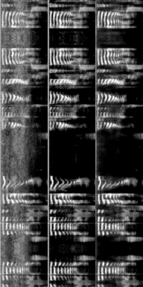

## goznak
Тестовое задание

### Задание 1:
> Написать программу с функцией multiplicate(A), которая принимает на вход массив целых чисел А ненулевой длины и возвращает массив такой же длины, в котором на i-ом месте находится произведение всех чисел массива А, кроме числа, стоящего на i-ом месте.
#### Решение:
```python
def multiplicate(A):
    n = len(A)
    if n == 0:
        return []
    elif n == 1:
        return [0]
    B = [-1 for _ in range(n)]
    # сначала домножаем на все числа левее i-го
    temp = 1
    for i in range(n):
        B[i] = temp
        temp *= A[i]
    # теперь правее i-го
    temp = 1
    for i in range(n - 1, -1, -1):
        B[i] *= temp
        temp *= A[i]
    return B
```

### Задание 2:
> Классификация: необходимо реализовать алгоритм, позволяющий определить, является ли аудиозапись зашумлённой или нет.

> Denoising: необходимо реализовать алгоритм, позволяющий избавиться от посторонних шумов в звуковом сигнале.
#### Решение:

Папка **data** с данными, путь к которой указывается в конфиге, должна иметь следующий вид (без лишних вложений в train и val):
- data
  - train
    - clean
    - noisy
  - val
    - clean
    - noisy

Папка train используется для обучения, папка val -- для подсчета финальных метрик.
В качестве модели используется Unet с дополнительной головой на классификацию (есть шум/нет шума), так что сразу одновременно решаются обе задачи.
На этапе предсказаний возможны 2 варианта подсчета метрик:
- с независимыми головами (просто считается Accuracy и MSE)
- с зависимыми головами (в этом случае, если классификатор предсказал, что шума нет, то считаем, что маску предсказывать не надо)

**Важно**: во время подсчета финальных метрик зашумленные и чистые записи появляются равновероятно.

##### Воспроизвести все этапы
```bash
pip3 install -r requirements.txt
python3 train.py
python3 test.py
```

#### Итоговые метрики:
1. Независимые головы
> classification ===> **0.993**
> regression ===> **0.016560541**

2. Зависимые головы
> classification ===> **0.9925**
> regression ===> **0.015218494**

#### Визуализация предсказаний:
На каждой картинке в виде отдельных столбцов представлены три спектрограммы:
- **слева** -- для зашумленной записи (NOISY)
- **центр** -- ground_truth ответ для зашумленной записи (GT)
- **справа** -- предсказание модели (PR)

NOISY-GT-PR               |  NOISY-GT-PR
:-------------------------:|:-------------------------:
  |  
  |  